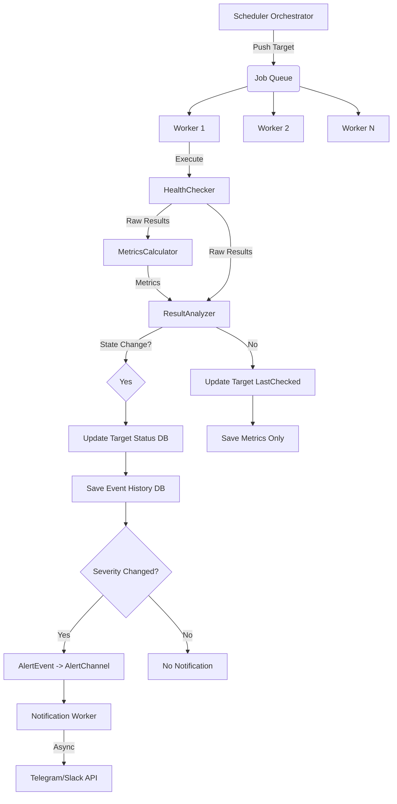

# Roadmap: Sistema de Monitoreo (✅ 95% Completion)

El sistema de monitoreo está completamente implementado con arquitectura concurrente, notificaciones asíncronas y modo simulador.

## ✅ Arquitectura Implementada

### Componentes Core
- [x] **`Orchestrator`**: Worker pool concurrente con channels
- [x] **`HealthChecker`**: Lógica de verificación con reintentos adaptativos
- [x] **`MetricsCalculator`**: Estadísticas en tiempo real y promedios móviles
- [x] **`ResultAnalyzer`**: Determinación inteligente de 6 estados de servicio
- [x] **`StateUpdater`**: Actualización atómica de estado en BD
- [x] **`NotificationDispatcher`**: Queue asíncrono con Go channels

### Estados de Servicio
- [x] **UP**: Servicio funcionando correctamente
- [x] **DOWN**: Servicio completamente caído
- [x] **DEGRADED**: Rendimiento reducido (>2x promedio histórico)
- [x] **UNSTABLE**: Comportamiento inestable (5-9 checks)
- [x] **FLAPPING**: Cambios frecuentes de estado (>12 checks)
- [x] **UNKNOWN**: Estado no determinado

### Características Técnicas
- [x] **Concurrencia**: Worker pool configurable
- [x] **Anti-Flapping**: Lógica de estabilidad de 3 checks consecutivos
- [x] **Métricas Históricas**: EMA 7 días, uptime/downtime tracking
- [x] **Notificaciones Asíncronas**: No bloquean el monitoring
- [x] **Persistencia Robusta**: PostgreSQL con GORM

## ✅ Integración Completa

### Con Notificaciones
- [x] **AlertEvent System**: Eventos agnósticos de severidad
- [x] **SeverityMapper**: Conversión automática estado → severidad
- [x] **Telegram Integration**: Magic link + polling/webhook
- [x] **Async Queue**: Procesamiento en background

### Con Base de Datos
- [x] **Check Results**: Historial completo de verificaciones
- [x] **Target Statistics**: Métricas agregadas por target
- [x] **Migration System**: Auto-migraciones GORM

### Con API
- [x] **REST Endpoints**: CRUD completo de targets
- [x] **Swagger Docs**: Documentación automática
- [x] **JWT Auth**: Endpoints protegidos

## 🎯 Modo Simulador

Para testing y demostraciones sin requests HTTP reales:

```go
// En internal/monitoring/module.go
// Cambiar executeScheduler() para usar SimulatorScheduler
```

### Características del Simulador
- [x] **Escenarios Realistas**: 8 ciclos de comportamiento evolutivo
- [x] **Estados Dinámicos**: Stable → Degraded → Unstable → Flapping → Down
- [x] **Métricas Falsas**: Response times y estados simulados
- [x] **Notificaciones Reales**: Envía alertas a canales configurados

## 📊 Rendimiento

### Configuración Recomendada
```go
// TargetsPerWorker = 1 (máxima velocidad)
// TargetsPerWorker = 5 (balanceado para producción)
workerCount := (len(targets) + TargetsPerWorker - 1) / TargetsPerWorker
```

### Métricas de Ejecución
- **Concurrencia**: Procesamiento paralelo de targets
- **Throughput**: ~50-100 targets/minuto (depende de timeouts)
- **Memoria**: Eficiente con channels y goroutines
- **Persistencia**: Bulk operations para optimización

## 🔧 Configuración

### Variables de Entorno
```bash
# Scheduler
SCHEDULER_INTERVAL=1m        # Frecuencia de ejecución
WORKER_COUNT=auto           # Auto-calculado por targets
TARGETS_PER_WORKER=1        # 1 = modo hilo-por-target

# Timeouts
HEALTH_CHECK_TIMEOUT=5s      # Timeout por check
MAX_CHECKS=12               # Máximo reintentos

# Notificaciones
NOTIFICATION_BUFFER=100      # Tamaño del channel de alertas
```

## 📈 Próximos Pasos (Opcionales)

### Optimizaciones
- [ ] **Adaptive Pool**: Ajuste dinámico del número de workers
- [ ] **Circuit Breaker**: Protección contra servicios persistentemente down
- [ ] **Health Score**: Sistema de puntuación de salud
- [ ] **Predictive Alerts**: Detección de tendencias

### Nuevas Integraciones
- [ ] **Prometheus Metrics**: Exposición de métricas para monitoring
- [ ] **Alertmanager**: Integración con sistemas de alertas existentes
- [ ] **Custom Checks**: Scripts personalizados por target
- [ ] **Geographic Checks**: Verificación desde múltiples regiones

### Escalabilidad
- [ ] **Distributed Workers**: Workers en múltiples instancias
- [ ] **Queue System**: Redis/Kafka para trabajos distribuidos
- [ ] **Sharding**: Particionamiento por dominio/servicio

## 🧪 Testing

### Unit Tests
- [x] **Componentes Individuales**: HealthChecker, MetricsCalculator, etc.
- [x] **Estados de Servicio**: Verificación de lógica de transición
- [x] **Anti-Flapping**: Tests de estabilidad

### Integration Tests
- [x] **Full Pipeline**: Target → Check → Analysis → Notification
- [x] **Database Persistence**: Verificación de escrituras
- [x] **Async Notifications**: Testing de queue

### E2E Tests
- [x] **API Endpoints**: CRUD operations
- [x] **Notification Flow**: Alert → Telegram message
- [x] **Simulator Mode**: Verificación de escenarios

## 🎉 Estado Actual

El sistema de monitoreo está **completamente funcional** con:

- ✅ Arquitectura concurrente y escalable
- ✅ 6 estados inteligentes de servicio
- ✅ Notificaciones asíncronas vía Telegram
- ✅ Modo simulador para testing
- ✅ API REST completa con documentación
- ✅ Persistencia robusta en PostgreSQL
- ✅ Clean Architecture con separación de responsabilidades

El scheduler no debe iterar uno por uno. Debe despachar trabajo.

- [x] **Diseñar `WorkerPool` (`Orchestrator`)**:
    - Implementado en `orchestrator.go`.
    - Configurable: `NumWorkers`.
    - Job Queue: `chan *MonitoringTarget`.
- [x] **Refactorizar `Scheduler.Start()`**:
    - Implementado el ciclo de vida en `Orchestrator`.
    - 1. Iniciar Workers.
    - 2. Enviar targets al Job Queue.
    - 3. Esperar finalización (WaitGroup).

## Fase 2.5: Simulación y Verificación (✅ Completado)

Antes de integrar con la DB real, verificamos la lógica con un simulador.

- [x] **Simulador (`simulator/main.go`)**:
    - Implementado con **Peticiones HTTP Reales** (Google, HttpBin).
    - Escenarios probados: Stable UP, Stable DOWN (500), Degraded (Delay > 2x Histórico).
    - Verificación de Métricas: Confirmado que el promedio ignora fallos y estados degradados.

## Fase 3: Integración de Notificaciones Asíncronas (🚧 En Progreso)

Las notificaciones son I/O bound y lentas. El módulo de `notifications` ya está listo para recibir eventos.

- [ ] **Conectar `Orchestrator` con `NotificationDispatcher`**:
    - El orquestador debe pasar el resultado del análisis al dispatcher.
- [ ] **Implementar `NotificationWorker`**:
    - Goroutine que escucha `alertChannel`.
    - Llama al `NotificationService` (que ya tiene los Senders de Telegram configurados).
- [ ] **Integrar `SeverityMapper`**:
    - El `ResultAnalyzer` usará el `SeverityMapper` para convertir el cambio de estado en un `AlertEvent`.
    - Si `ShouldNotify()` es true, se envía al canal.

## Fase 4: Persistencia y Métricas (🚧 Pendiente)

- [ ] **Optimizar Escrituras**:
    - Evaluar si guardar cada check o solo los cambios de estado/métricas agregadas.
    - Mover la persistencia (`saveToSQL`, `updateStatistics`) fuera del loop crítico del worker si es posible (o hacerlo eficiente).
- [ ] **Conectar Repositorios Reales**:
    - Reemplazar `InMemoryTargetRepo` del simulador por `PostgresTargetRepository`.

## Fase 5: Limpieza y Migración

- [ ] **Eliminar `Scheduler` monolítico**: Reemplazar por la versión orquestadora.
- [ ] **Borrar código legacy**: Eliminar `alert_message.go` y los `fmt.Print` directos.
- [ ] **Configuración**: Permitir inyectar el tamaño del pool y timeouts desde configuración.

---

## Diagrama de Flujo Propuesto


