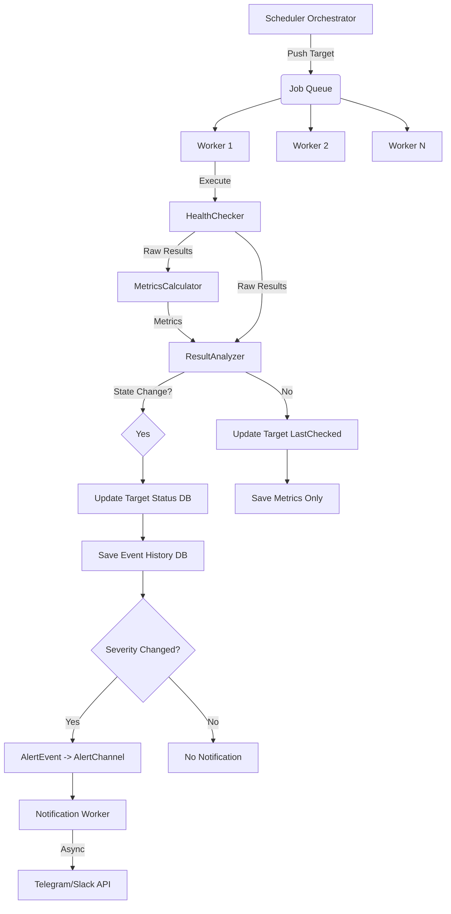

# Roadmap: Refactorización del Scheduler (Scalable & Async)

Este documento define el plan para transformar el Scheduler actual ("todólogo" y síncrono) en un sistema robusto, concurrente y desacoplado.

## Objetivos
1.  **Concurrencia**: Procesar múltiples targets en paralelo (Worker Pool).
2.  **Desacoplamiento**: Separar la ejecución del check, el análisis de resultados y las notificaciones.
3.  **Asincronía**: Las notificaciones NO deben bloquear el proceso de monitoreo.
4.  **Limpieza**: Eliminar la lógica monolítica y usar la nueva arquitectura de Alertas (`AlertEvent`).

---

## Fase 1: Descomposición de Responsabilidades (SRP) (✅ Completado)

Actualmente el `Scheduler` hace todo. Vamos a dividirlo en componentes especializados:

- [x] **`HealthChecker`**:
    - Responsabilidad: Ejecutar la lógica de "Ping hasta estabilidad" (los 12 intentos).
    - Input: `MonitoringTarget`.
    - Output: `CheckSessionResult` (Raw results, pings count).
    - *Nota*: No decide si es UP/DOWN, solo recopila datos.

- [x] **`MetricsCalculator`**:
    - Responsabilidad: Calcular estadísticas de la sesión actual y actualizar históricos.
    - Capacidades:
        - Actual: Promedio (Avg) **(Solo considera estados UP para no ensuciar la línea base)**, MaxResponseTime.
        - Histórico: Actualizar promedios móviles (EMA 7 días), contadores de uptime/downtime.
    - Input: `CheckSessionResult`.
    - Output: `SessionMetrics` (Struct con los valores calculados).

- [x] **`ResultAnalyzer` (o `Evaluator`)**:
    - Responsabilidad: Determinar el estado final (`UP`, `DOWN`, `DEGRADED`, `FLAPPING`, `UNSTABLE`).
    - Lógica:
        - 3 consecutivos = Estable.
        - Tiempo > 2x Promedio Histórico = Degraded.
        - 5-9 intentos = Unstable.
        - >12 intentos = Flapping.
    - Input: `CheckSessionResult`, `SessionMetrics`, `HistoricalStats`.
    - Output: `TargetStatus` (Nuevo estado).

- [x] **`StateUpdater`**:
    - Responsabilidad: Actualizar la entidad `MonitoringTarget` (Status, LastCheckedAt, LastResponseTime) en memoria y base de datos.
    - *Nota*: Esto es crucial para que el Dashboard muestre el estado actual inmediato, independiente del historial de eventos.

- [ ] **`NotificationDispatcher`**:
    - Responsabilidad: Enviar alertas de forma asíncrona.
    - Estado: Estructura creada, falta integración con el módulo de `notifications`.

## Fase 2: Implementación del Worker Pool (✅ Completado / En Validación)

El scheduler no debe iterar uno por uno. Debe despachar trabajo.

- [x] **Diseñar `WorkerPool` (`Orchestrator`)**:
    - Implementado en `orchestrator.go`.
    - Configurable: `NumWorkers`.
    - Job Queue: `chan *MonitoringTarget`.
- [x] **Refactorizar `Scheduler.Start()`**:
    - Implementado el ciclo de vida en `Orchestrator`.
    - 1. Iniciar Workers.
    - 2. Enviar targets al Job Queue.
    - 3. Esperar finalización (WaitGroup).

## Fase 2.5: Simulación y Verificación (✅ Completado)

Antes de integrar con la DB real, verificamos la lógica con un simulador.

- [x] **Simulador (`simulator/main.go`)**:
    - Implementado con **Peticiones HTTP Reales** (Google, HttpBin).
    - Escenarios probados: Stable UP, Stable DOWN (500), Degraded (Delay > 2x Histórico).
    - Verificación de Métricas: Confirmado que el promedio ignora fallos y estados degradados.

## Fase 3: Integración de Notificaciones Asíncronas (🚧 Pendiente)

Las notificaciones son I/O bound y lentas (HTTP requests a Telegram/Slack). No pueden frenar el monitoreo.

- [ ] **Conectar `Orchestrator` con `NotificationDispatcher`**:
    - El orquestador debe pasar el resultado del análisis al dispatcher.
- [ ] **Implementar `NotificationWorker`**:
    - Goroutine que escucha `alertChannel`.
    - Llama al `NotificationService` (que usará los Adapters de Telegram/Slack).
- [ ] **Integrar `SeverityMapper`**:
    - El `ResultAnalyzer` usará el `SeverityMapper` para convertir el cambio de estado en un `AlertEvent`.
    - Si `ShouldNotify()` es true, se envía al canal.

## Fase 4: Persistencia y Métricas (🚧 Pendiente)

- [ ] **Optimizar Escrituras**:
    - Evaluar si guardar cada check o solo los cambios de estado/métricas agregadas.
    - Mover la persistencia (`saveToSQL`, `updateStatistics`) fuera del loop crítico del worker si es posible (o hacerlo eficiente).
- [ ] **Conectar Repositorios Reales**:
    - Reemplazar `InMemoryTargetRepo` del simulador por `PostgresTargetRepository`.

## Fase 5: Limpieza y Migración

- [ ] **Eliminar `Scheduler` monolítico**: Reemplazar por la versión orquestadora.
- [ ] **Borrar código legacy**: Eliminar `alert_message.go` y los `fmt.Print` directos.
- [ ] **Configuración**: Permitir inyectar el tamaño del pool y timeouts desde configuración.

---

## Diagrama de Flujo Propuesto

