# UI Prototipo - SystemWatch

## Descripción del Flujo

El prototipo de SystemWatch cubre el flujo completo de un sistema de monitoreo de aplicaciones web. Comienza con la autenticación del usuario (login y registro), seguido del dashboard principal donde se muestran los sistemas monitoreados. Desde el dashboard, el usuario puede navegar a vistas detalladas de sistemas individuales, agregar nuevos sistemas, gestionar el equipo, configurar notificaciones y generar reportes avanzados. El flujo está diseñado para proporcionar una experiencia intuitiva y completa para administradores de sistemas que necesitan monitoreo en tiempo real.

## Pantallas del Prototipo

### 1. Pantalla de Login
**Propósito:** Permite el acceso directo al dashboard sin necesidad de completar formularios (versión prototipo/demo).

**Componentes principales:**
- Formulario de login con campos de correo electrónico y contraseña (no funcionales en prototipo)
- Opción para mostrar/ocultar contraseña
- Botón de "Iniciar Sesión" que permite acceso directo
- Enlace para "¿Olvidaste tu contraseña?"
- Botón para "Crear cuenta" (registro)
- Logo y branding de SystemWatch

**Captura de pantalla:** 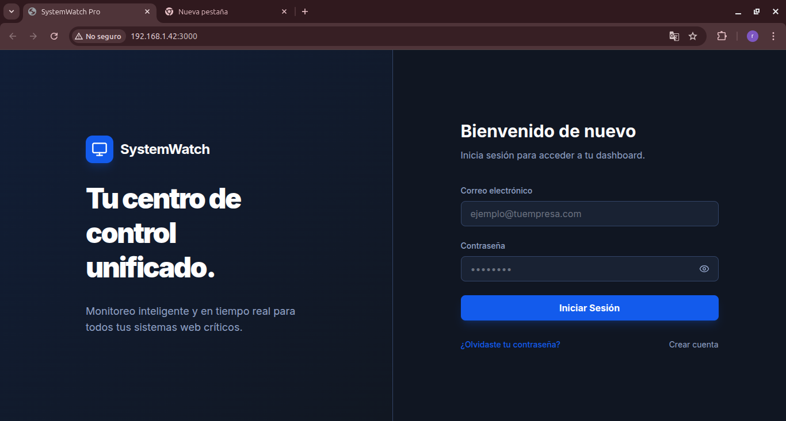 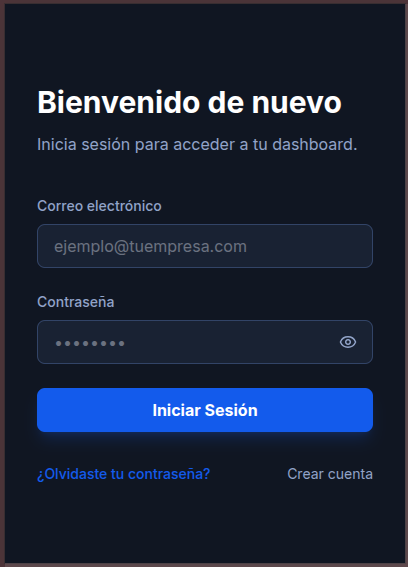

### 2. Pantalla de Registro
**Propósito:** Permite a nuevos usuarios crear una cuenta en el sistema para acceder al dashboard de monitoreo.

**Componentes principales:**
- Formulario de registro con campos de nombre de usuario, correo electrónico y contraseña
- Botón de "Registrarse"
- Enlace para iniciar sesión si ya tienen cuenta
- Logo y branding de SystemWatch

**Captura de pantalla:** 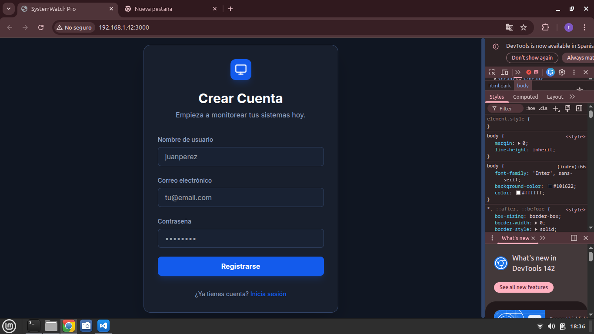 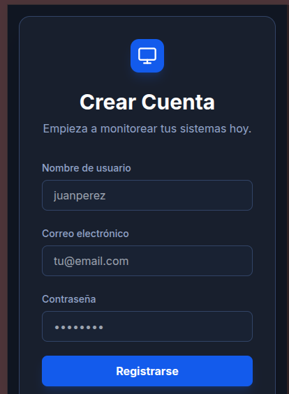

### 3. Dashboard General
**Propósito:** Vista principal que muestra un overview de todos los sistemas monitoreados, incluyendo estadísticas generales y lista de sistemas con sus estados actuales.

**Componentes principales:**
- Estadísticas resumen (total de sistemas, sistemas online, sistemas con alertas)
- Barra de búsqueda y filtros por estado
- Lista de tarjetas de sistemas con información de uptime, tiempo de respuesta y último chequeo
- Botón para agregar nuevo sistema
- Navegación lateral con menú principal

**Captura de pantalla:**  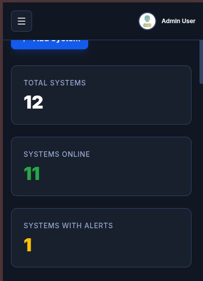

### 4. Detalle de Sistema
**Propósito:** Vista detallada de un sistema específico, mostrando métricas históricas, estado actual y gráficos de rendimiento.

**Componentes principales:**
- Información del sistema (estado actual, disponibilidad, tiempo de respuesta promedio, picos de CPU)
- Histograma de estado en las últimas 24 horas
- Mapa de calor de tiempos de respuesta en los últimos 7 días
- Gráficos de métricas de rendimiento (tiempo de respuesta y uso de CPU)
- Botón de refresh y navegación breadcrumb

**Captura de pantalla:** 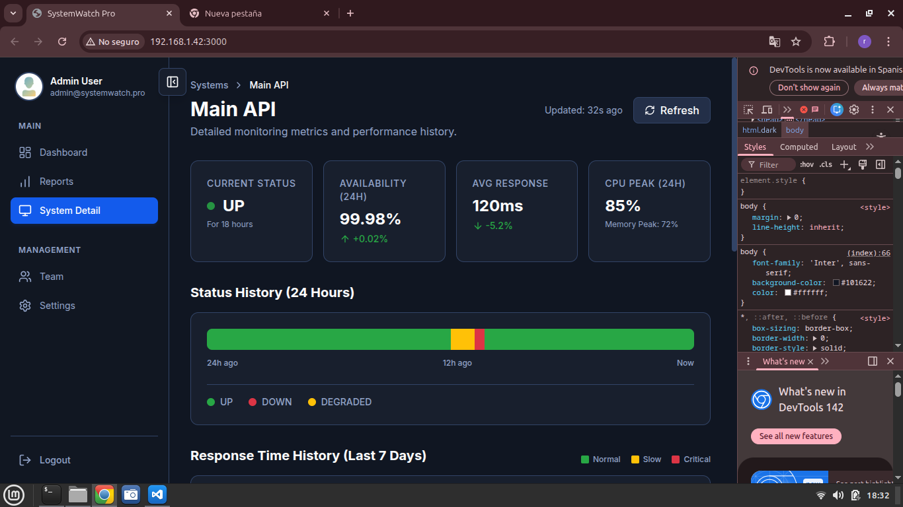 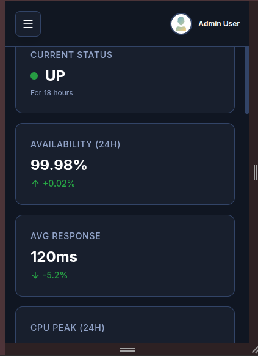 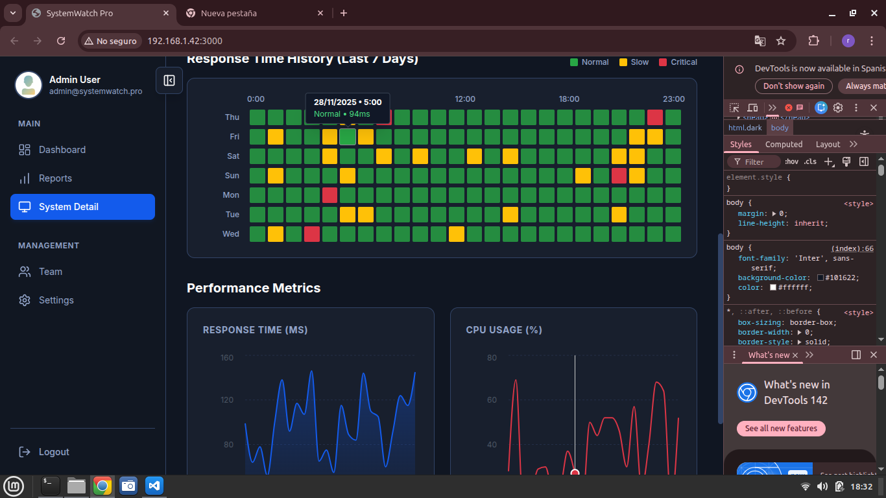 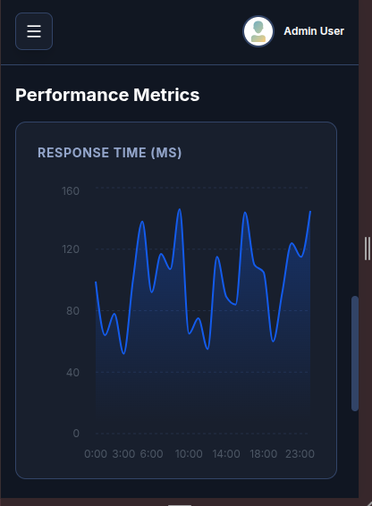

### 5. Agregar Sistema
**Propósito:** Formulario para configurar y agregar un nuevo sistema al monitoreo.

**Componentes principales:**
- Formulario con campos para nombre del sistema y URL a monitorear
- Configuración de intervalo de monitoreo (1 min, 3 min, 5 min)
- Opción para monitoreo interno de red
- Botones de cancelar y agregar sistema

**Captura de pantalla:** 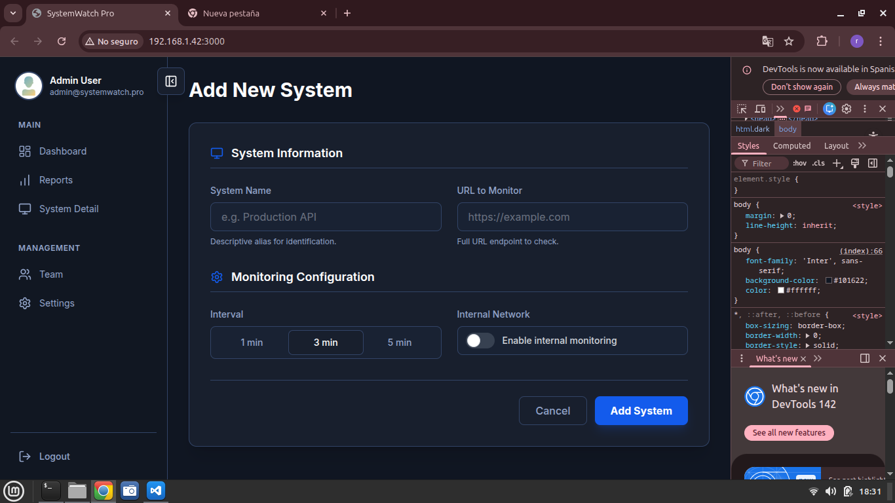 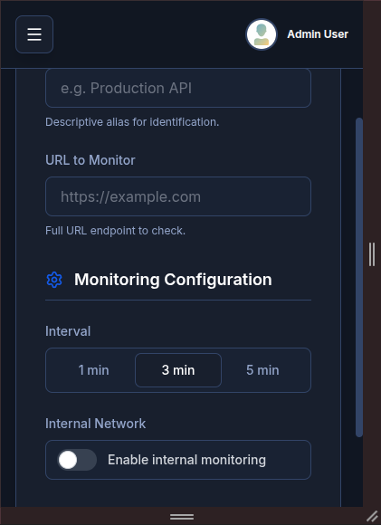

### 6. Configuración de Notificaciones
**Propósito:** Permite configurar canales de notificación para alertas en tiempo real (Slack, Telegram, WhatsApp).

**Componentes principales:**
- Lista de canales de notificación con toggles para activar/desactivar
- Información sobre cada canal (descripción, estado beta si aplica)
- Botón para guardar cambios

**Captura de pantalla:** 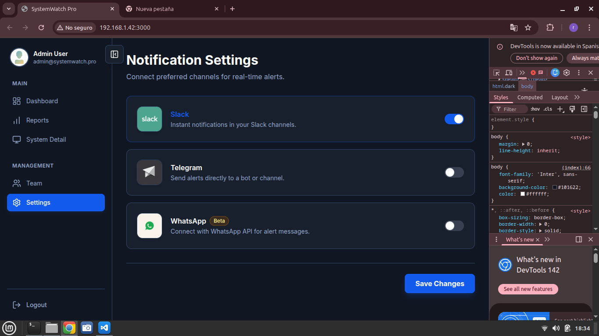 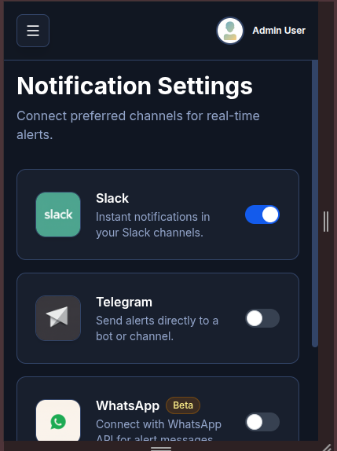

### 7. Gestión de Equipo
**Propósito:** Interfaz para administrar miembros del equipo, incluyendo invitaciones, roles y estados de usuarios.

**Componentes principales:**
- Barra de búsqueda y filtros por rol
- Tabla de miembros con información de usuario, rol, fecha de ingreso y estado
- Botón para invitar nuevo usuario
- Paginación de resultados

**Captura de pantalla:** 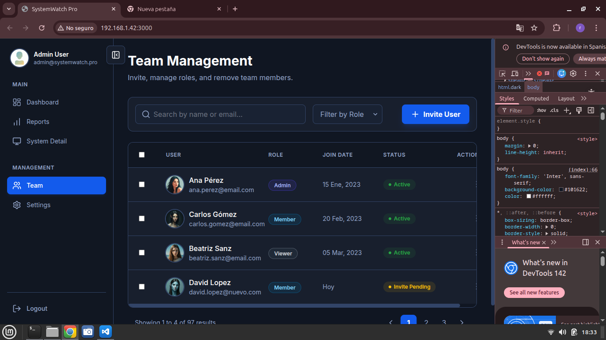 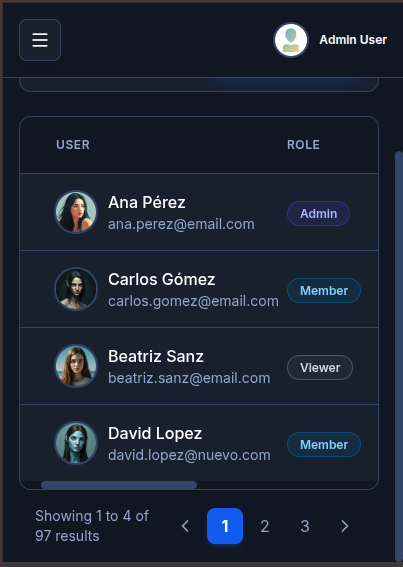

### 8. Reportes Avanzados
**Propósito:** Generador de reportes con filtros configurables para analizar datos históricos de sistemas monitoreados.

**Componentes principales:**
- Panel lateral de configuración con selector de rango de fechas, sistema objetivo y métricas
- Calendario interactivo para selección de fechas
- Lista de métricas disponibles con checkboxes
- Área principal con placeholder para reportes generados
- Botón para generar reporte

**Captura de pantalla:** 